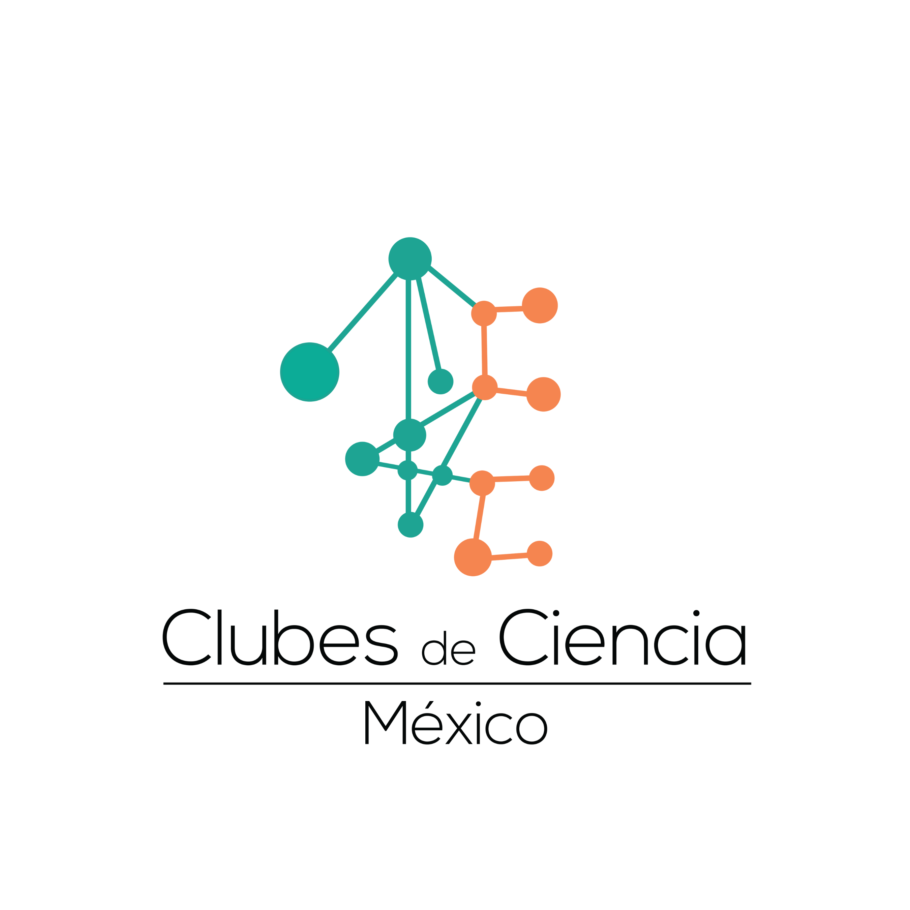
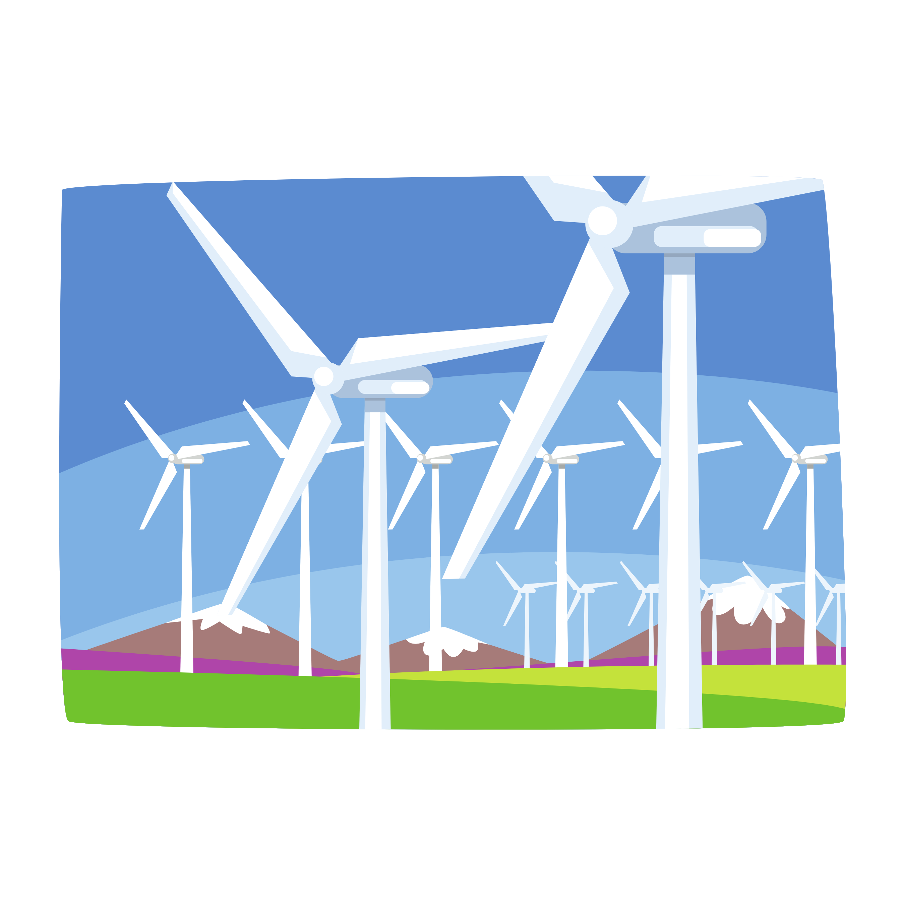
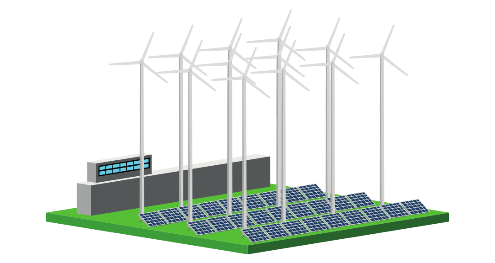
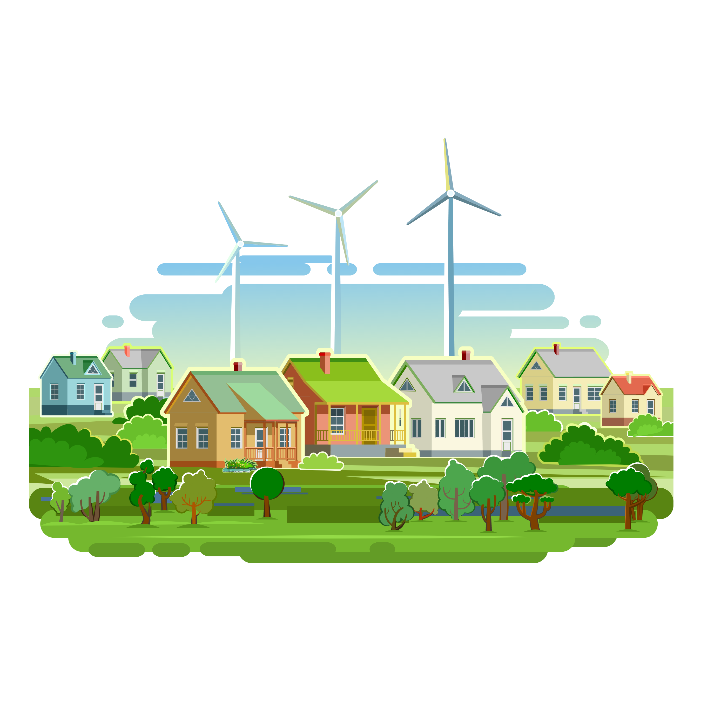
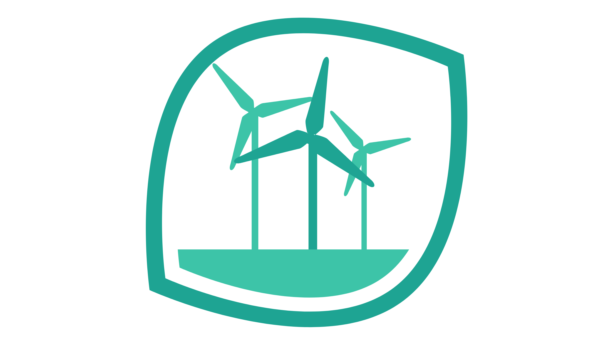

<!DOCTYPE html>
<html lang="en">

<head>
  <meta charset="utf-8">
  <meta content="width=device-width, initial-scale=1.0" name="viewport">

  <title>CDCMX Challenge</title>
  <meta content="" name="description">
  <meta content="" name="keywords">

  <!-- Favicons -->
  <link href="assets/img/eolica5.png" rel="icon">
  <link href="assets/img/eolica5.png" rel="apple-touch-icon">

  <!-- Google Fonts -->
  <link href="https://fonts.googleapis.com/css?family=Open+Sans:300,300i,400,400i,600,600i,700,700i|Raleway:300,300i,400,400i,500,500i,600,600i,700,700i|Poppins:300,300i,400,400i,500,500i,600,600i,700,700i" rel="stylesheet">

  <!-- Vendor CSS Files -->
  <link href="assets/vendor/bootstrap/css/bootstrap.min.css" rel="stylesheet">
  <link href="assets/vendor/bootstrap-icons/bootstrap-icons.css" rel="stylesheet">
  <link href="assets/vendor/boxicons/css/boxicons.min.css" rel="stylesheet">
  <link href="assets/vendor/glightbox/css/glightbox.min.css" rel="stylesheet">
  <link href="assets/vendor/swiper/swiper-bundle.min.css" rel="stylesheet">

  <!-- Template Main CSS File -->
  <link href="assets/css/style.css" rel="stylesheet">

</head>

<body>

  <!-- ======= Header ======= -->
  <header id="header" class="fixed-top">
    

      <h1 class="logo"><a href="index.html">Energía eólica</a></h1>
      <!-- Uncomment below if you prefer to use an image logo -->
      <!-- -->

      <nav id="navbar" class="navbar">
        <ul>
          <li><a class="nav-link scrollto active" href="#inicio">Inicio</a></li>
          <li><a class="nav-link scrollto" href="#intro">Introducción</a></li>
          <li><a class="nav-link scrollto" href="#marco">Marco Teórico</a></li>
          <li><a class="nav-link scrollto" href="#objetivos">Objetivos</a></li>
          <li><a class="nav-link scrollto" href="#justif">Justificación</a></li>
          <li><a class="nav-link scrollto" href="#metodo">Metodología</a></li>
          <li><a class="nav-link scrollto" href="#resultados">Resultados</a></li>
          <li><a class="nav-link scrollto" href="#conclusiones">Conclusiones</a></li>
          <li><a class="nav-link scrollto " href="#video">Video</a></li>
          <li><a class="nav-link scrollto" href="#equipo">Equipo</a></li>
          <li><a class="nav-link scrollto" href="#referencias">Referencias</a></li>
        </ul>
        <i class="bi bi-list mobile-nav-toggle"></i>
      </nav><!-- .navbar -->

    

  </header><!-- End Header -->

  <!-- ======= Hero Section ======= -->
  <section id="hero" class="d-flex align-items-center">

    

      

        

          <h1>La energía eólica en el ámbito rural</h1>
          <h2>Proyecto final para Clubes de Ciencia México 2021.</h2>
          

            <a href="#intro" class="btn-get-started scrollto">Introducción</a>
            <a href="https://www.youtube.com/watch?v=jDDaplaOz7Q" class="glightbox btn-watch-video"><i class="bi bi-play-circle"></i>Ver video</a>
          

        

        

          
        

      

    

  </section><!-- End Hero -->

  <main id="main">

        <!-- ======= Introducción ======= -->
    <section id="intro" class="services section-bg">
      

    
            

              Introducción
              <h2>Introducción</h2>
              
<b>¿Qué problemática abordaremos?</b>

              

                En México, muchas poblaciones rurales no cuentan con energía eléctrica de manera regular debido a carencias o 
                irregularidades en el suministro. Además, debido al relieve y condiciones meteorológicas de algunas zonas, es 
                difícil suministrar correctamente energía.
              
  
              
<b>¿Por qué es importante esta problemática?</b>

              

                La energía eléctrica es imprescindible para realizar toda clase de tareas, algunas de ellas de vital importancia.
                Un ejemplo de los estragos de esta problemática es la falta de medicamentos, vacunas y antídotos, como resultado de 
                un suministro errático de energía, el cual no permite mantener a los insumos a una temperatura regular y así 
                propiciando su rápida degradación.
              
  
              
<b>¿Cómo se relaciona con la ODS de nuestro club?</b>

              

                El objetivo de desarrollo sostenible de nuestro club está enfocado en promover el uso de energías renovables a gran escala. Como parte
                de nuestro proyecto se plantea la implementación de la energía eólica en comunidades rurales con el objetivo de proveerlos de un suministro 
                eléctrico regular y confiable basado en energías renovables a pequeña escala, para una posterior ampliación e incluso el anexo de otras 
                ecotecnologías.
              
  
              
<b>¿Cómo se relaciona lo aprendido en nuestro club para resolver el problema que planteamos?</b>

              

                Mediante el uso de la información bibliográfica proporcionada durante el curso e impartida por los instructores,  se generó el presente
                proyecto para emplear la práctica de la energía eólica en un prototipo de instalación en una comunidad rural y el vínculo que este 
                presenta con el desarrollo sostenible y mejora de calidad de vida de las personas.
              
  
              

                Adicionalmente al desarrollo tecnológico, es necesario reforzar aspectos legales que fomenten e incentiven la producción de energía 
                eólica, y establecer regulaciones y normas ambientales que protejan al ambiente y a las poblaciones silvestres.
              
  
              
            

            
        

      

    </section><!-- Termina Introducción -->

        <!-- ======= Marco Teórico ======= -->
        <section id="marco" class="services section-bg">
          

        
                

                  Marco teórico:
                  <h2>Marco teórico:</h2>
                  

                    La incorporación creciente de fuentes renovables de energía en los sistemas energéticos obedece a motivos, 
                    tanto de <b>diversificación</b> y <b>seguridad energéticas</b>, como de combate al cambio climático, generación de empleos, mejor acceso
                    a la energía e impulso al desarrollo rural.
                  
  
                  

                    México se encuentra entre los países con locaciones idóneas para la <b>explotación eólica a gran escala.</b> Los primeros 
                    estudios serios de alcance nacional para valorar las cualidades y distribución de los vientos en el territorio mexicano 
                    se realizaron en 1980. Donde destacó la región sur del <b>istmo de Tehuantepec</b>, en el estado de Oaxaca, donde la velocidad 
                    media anual de los vientos tiene variaciones estacionales extremas en el transcurso del año.
                  
  
                  

                    Los vientos en el istmo de Tehuantepec son además relativamente estables, un porcentaje alto de horas por año, de ahí que su 
                    potencial energético sea considerado como <b>excelente</b>. Las características topográficas del istmo de Tehuantepec son igualmente 
                    favorables para la instalación de parques eólicos. 
                  
  
                  

                    La construcción de centrales eólicas en el istmo de Tehuantepec es liderada por <b>empresas privadas</b>, fundamentalmente extranjeras. 
                    Los intereses de estas empresas frecuentemente chocan con los de las comunidades locales donde se pretenden erigir los proyectos. 
                    Ello se refleja en el descontento social creciente ante el despliegue masivo de aerogeneradores, luego de constatar que el desarrollo 
                    eólico no ha beneficiado en la medida esperada a los pobladores locales.
                  
  
                  
                

            

          

        </section><!-- Termina Marco Teórico -->

    <!-- ======= Marco Teórico 2 ======= -->
    <section id="about" class="about">
      

        

          

            
          

          

            <h3>Energía eólica en México ocupada en el ámbito rural.</h3>
            

              El concepto de energía eólica se refiere a aquella energía cinética generada por la fuerza del viento, la cual 
              puede ser aprovechada de diferentes formas. México cuenta con un inmenso potencial eólico, algunos sitios identificados
              con viento de alta calidad son las zonas costeras, entre ellas:
            

            <ul>
              <li><i class="bi bi-check-circle"></i> Baja California</li>
              <li><i class="bi bi-check-circle"></i> Baja California Sur</li>
              <li><i class="bi bi-check-circle"></i> Sonora</li>
              <li><i class="bi bi-check-circle"></i> Oaxaca</li>
              <li><i class="bi bi-check-circle"></i> Yucatán</li>
            </ul>
            

              Desafortunadamente, dicho potencial no ha sido aprovechado. El presente proyecto analizó zonas rurales con potencial para la 
              generación de energía a partir de los vientos en México, considerando los aspectos sociales y económicos involucrados en el
              desarrollo de proyectos de energía eólica.
            

          

        

      

    </section><!-- Termina Marco Teórico 2 -->

    <!-- ======= Objetivos ======= -->
    <section id="objetivos" class="services section-bg">
      

        

          Objetivos:
          <h2>Objetivos:</h2>
          

            Emplear el viento, como recurso natural, para reducir la contaminación ambiental y generar energía renovable a partir de 
            aerogeneradores, con el propósito de satisfacer de manera sustentable las necesidades de una comunidad en Oaxaca sin 
            comprometer el futuro del planeta en el proceso.
          

        

      

    </section><!-- Termina Objetivos -->

        <!-- ======= Justificación ======= -->
        <section id="justif" class="about">
          

    
            

              

                
              

              

                <h3>Justificación del proyecto:</h3>
                <ul>
                  <li><i class="bi bi-check-circle"></i> La energía eólica es una fuente de electricidad limpia e inagotable.
                  <li><i class="bi bi-check-circle"></i> Permite satisfacer las necesidades de la sociedad sin comprometer a las generaciones futuras.</li>
                  <li><i class="bi bi-check-circle"></i> Beneficios ambientales, sociales, económicos y energéticos.</li>
                  <li><i class="bi bi-check-circle"></i> La promoción de la energía eólica a pequeña y gran escala es deseable.</li>
                </ul>
              

            

    
          

        </section><!-- Termina Justificación -->

    <!-- ======= Metodología ======= -->
    <section id="metodo" class="services section-bg">
      

    
            

              Metodología:
              <h2>Metodología:</h2>
              
<b>A continuación, presentamos un diagrama sobre los pasos que se siguieron para concluir el proyecto:</b>

            

            
        

      

    </section><!-- Termina Metodología -->

        <!-- ======= Resultados ======= -->
        <section id="resultados" class="about">
          

    
            

              

                
              

              

                <h3>Resultados:</h3>
                

                  Lorem ipsum dolor sit amet, consectetur adipiscing elit. Etiam consequat mi justo, dictum hendrerit sem volutpat non. Curabitur 
                  cursus nunc sem, non rutrum diam varius vitae. Morbi vitae quam dapibus, porttitor est vel, malesuada libero. Nulla facilisi. 
                  Quisque tortor purus, efficitur et dictum in, porttitor.
                

                <ul>
                  <li><i class="bi bi-check-circle"></i> Mauris ut.</li>
                  <li><i class="bi bi-check-circle"></i> Lorem ipsum.</li>
                  <li><i class="bi bi-check-circle"></i> Fusce in.</li>
                  <li><i class="bi bi-check-circle"></i> Suspendisse eget.</li>
                  <li><i class="bi bi-check-circle"></i> Donec sed.</li>
                </ul>
                

                  Curabitur aliquam a mauris nec rhoncus. Aenean et justo urna. Duis dignissim mattis condimentum. Cras a rhoncus nibh, eget pharetra
                  elit. Etiam ut orci quis velit vestibulum consequat id ac mauris. Curabitur bibendum condimentum dolor, a porttitor risus luctus vitae.
                  Duis iaculis dui ante, vel aliquam augue dignissim at. Vestibulum posuere ullamcorper eros. Nullam sit.
                

              

            

    
          

        </section><!-- Termina Resultados -->

        <!-- ======= Conclusiones ======= -->
        <section id="conclusiones" class="services section-bg">
          

        
                

                  Conclusiones:
                  <h2>Conclusiones:</h2>
                  
<b>Fusce maximus mauris vitae ipsum.</b>

                  

                    Lorem ipsum dolor sit amet, consectetur adipiscing elit. Nam rhoncus felis nec tortor aliquet euismod. Etiam 
                    risus nisl, sollicitudin quis tincidunt eget, vestibulum vitae diam. Integer vitae risus euismod, accumsan neque vitae, 
                    dapibus lectus. Donec non varius tortor, a venenatis mauris. Nam efficitur porttitor velit a euismod. Integer at augue.
                  
  
                

            

          

        </section><!-- End Services Section -->

        <!-- ======= Video ======= -->
    <section id="video" class="services section-bg">
      

    
            

              Video:
              <h2>Video:</h2>
              <iframe width="560" height="315" src="https://www.youtube.com/embed/PLj1-CMNERM" title="YouTube video player" frameborder="0" allow="accelerometer; autoplay; clipboard-write; encrypted-media; gyroscope; picture-in-picture" allowfullscreen></iframe>
              
  
            

            
        

      

    </section><!-- Termina Video -->
    <!-- ======= Equipo ======= -->
    <section id="equipo" class="testimonials section-bg">
      

        

          Equipo:
          <h2>Equipo:</h2>
          
Conoce a las desarrolladoras del proyecto.

        

        

          

            

              

                

                  <i class="bx bxs-quote-alt-left quote-icon-left"></i>
                  Estudiante de Bachillerato. Reside en el estado de Oaxaca. Fanática de la lectura, la música y el deporte, sin duda, también de la ciencia.
                  <i class="bx bxs-quote-alt-right quote-icon-right"></i>
                

                
                <h3>Leilani Alfaro León</h3>
                <h4>Estudiante</h4>
              

            
<!-- Termina Leilani -->

            

              

                

                  <i class="bx bxs-quote-alt-left quote-icon-left"></i>
                  Estudiante de ingeniería Aeronáutica en el IPN. Apasionada de la música, la comida y por supuesto, la Ciencia. “Creo firmemente que la 
                  riqueza de la humanidad, es el corazón y las manos de quienes lo habitan”.
                  <i class="bx bxs-quote-alt-right quote-icon-right"></i>
                

                
                <h3>Guadalupe Zapata Castro</h3>
                <h4>Estudiante IPN</h4>
              

            
<!-- Termina Lupis -->

            

              

                

                  <i class="bx bxs-quote-alt-left quote-icon-left"></i>
                  Estudiante de ingeniería en energías renovables en la Facultad de Ingeniería UADY. Entusiasta por el cuidado del medio ambiente, el 
                  desarrollo de las ecotecnologías, el baile, los viajes y las culturas.
                  <i class="bx bxs-quote-alt-right quote-icon-right"></i>
                

                
                <h3>Geny Minelia Araujo Lara</h3>
                <h4>Estudiante UADY</h4>
              

            
<!-- Termina Geny -->

            

              

                

                  <i class="bx bxs-quote-alt-left quote-icon-left"></i>
                  Estudiante de Biología en la Facultad de Ciencias Biológicas de la UANL. Actualmente tengo 18 años y radico en el estado de Nuevo León. 
                  Me apasiona el cuidado de la naturaleza, la ciencia y la tecnología.
                  <i class="bx bxs-quote-alt-right quote-icon-right"></i>
                

                
                <h3>Diana Gabriela Díaz </h3>
                <h4>Estudiante UANL</h4>
              

            
<!-- Termina Noni -->
      

    </section><!-- Termina Equipo -->

    <!-- ======= Imágenes ======= -->
    <section id="imagenes" class="portfolio">
      

        

          Infografías y gráficas:
          <h2>Infografías y gráficas:</h2>
          
Contenido audiovisual relacionado al desarrollo del proyecto.

        

        

          

            
            

              <h4>Infografía 1</h4>
              
Infografía

              <a href="assets/img/portfolio/infografia1.png" data-gallery="portfolioGallery" class="portfolio-lightbox preview-link" title="El poder del viento en México, inforgrafía por Forbes México."><i class="bx bx-plus"></i></a>
            

          

          

            
            

              <h4>Infografía 2</h4>
              
Infografía

              <a href="assets/img/portfolio/infografia2.png" data-gallery="portfolioGallery" class="portfolio-lightbox preview-link" title="México necesita más energía eólica porque..., infografía por México Evalúa."><i class="bx bx-plus"></i></a>
            

          

          

            
            

              <h4>Mapa 1</h4>
              
Mapa

              <a href="assets/img/portfolio/mapa1.png" data-gallery="portfolioGallery" class="portfolio-lightbox preview-link" title="Mapa de la distribución geográfica del recurso potencial eólico por la CFE."><i class="bx bx-plus"></i></a>
            

          

        

      

    </section><!-- End Portfolio Section -->

 <!-- ======= Referencias ======= -->
 <section id="referencias" class="about">
  

    

      

        
      

      

        <h3>Referencias:</h3>
        <ul>
          <li><i class="bi bi-check-circle"></i> Borja-Díaz, M.A. y González-Galarza, R. (2000) Investigación y Desarrollo Tecnológico en el tema de la generación eoloeléctrica.
          Boletín iie. pp. 178-185. Recuperado el 21 de agosto de 2021, de https://www.ineel.mx/bolEA00/art1.pdf</li>
          <li><i class="bi bi-check-circle"></i> González-Ávila, María Eugenia, BeltrÁn-Morales, Luis F, Troyo-Diéguez, Enrique, & Ortega-Rubio, Alfredo. (2006). Potencial de 
            aprovechamiento de la energía eólica para la generación de energía eléctrica en zonas rurales de México. Interciencia, 31(4), 240-245. Recuperado en 21 de agosto de 
            2021, de http://ve.scielo.org/scielo.php?script=sci_arttext&pid=S0378-18442006000400002&lng=es&tlng=es.</li>
        </ul>
      

    

  

</section><!-- Termina Referencias -->

  </main><!-- End #main -->

  <a href="#" class="back-to-top d-flex align-items-center justify-content-center"><i class="bi bi-arrow-up-short"></i></a>

  <!-- Vendor JS Files -->
  
  
  
  
  
  

  <!-- Template Main JS File -->
  

</body>

</html>
